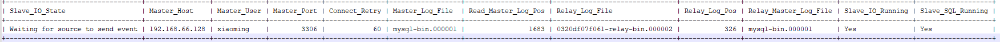

# MySql读写分离

## 使用Docker容器配置一台MySql服务器

- 拉取mysql镜像

  ```bash
  sudo docker pull mysql:8.0.28
  ```

- 运行容器

  ```bash
  docker run -d --name mysql -p 3307:3306 -v /path/:/var/lib/mysql/ -e MYSQL_ROOT_PASSWORD=root mysql:8.0.28 --lower_case_table_names=1
  ```

  ```
  参数解释
  -v：挂载宿主机目录和 docker容器中的目录，前面是宿主机目录，后面是容器内部目录。
  -d：后台运行容器。
  -p：映射容器端口号和宿主机端口号。
  -e：环境参数，MYSQL_ROOT_PASSWORD设置root用户的密码。
  –lower_case_table_names： 表名在硬盘上以小写保存，名称比较对大小写不敏感。
  ```

二、修改密码并配置远程连接
1、进入容器

```
docker exec -it mysql bash
```

2、连接并切换数据库

```bash
mysql -uroot -proot
use mysql
```

3、修改密码，设置所有主机可以访问

```bash
ALTER USER 'root'@'%' IDENTIFIED WITH mysql_native_password BY '新密码'
```

4、刷新权限

```bash
flush privileges
```

## 问题说明


当访问人员过多时，读和写都是由同一个数据库进行的操作，那么数据库的压力就会过大，容易造成单点故障


所以使用两个数据库，主库进行写操作，从库进行读操作，然后两个数据库进行数据同步（主从复制）即可

## 介绍

MySQL主从复制是一个异步的复制过程，底层是基于ysqI数据库自带的二进制日志功能。就是一台或多台MySQL数据库（slave,即从库)从另一台MySQL数据库（master.,即主库)进行日志的复制然后再解析日志并应用到自身，最终实现从库的数据和主库的数据保持一致。MySQL主从复制是MySQL数据库自带功能，无需借助第三方工具。

MySql主从复制分为三步

- master将改变记录到二进制日志(binary log)
- slave将masterl的binary log拷贝到它的中继日志(relay log)
- s1ave重做中继日志中的事件，将改变应用到自己的数据库中


## 配置

### 主库Master

第一步：修改mysql数据库的配置文件/etc/mysql/my.cnf

```bash
[mysqld]
# 主库配置
# 设置server_id，一般设置为IP,保证唯一就好
server_id=100

# 开启binlog，名字可以随意取
log-bin=mysql-bin

# binlog日志格式,（mixed,statement,row，默认格式是statement）
binlog_format=mixed

# 日志自动删除日期,默认值为0，表示不自动删除。
expire_logs_days=7

# 要同步的数据库
binlog-do-db=ride_share

# 复制过滤：也就是指定哪个数据库不用同步（mysql库一般不同步）
binlog-ignore-db=mysql,information_schema,sys,performance_schema

# 控制binlog的写入频率。每执行多少次事务写入一次(这个参数性能消耗很大，但可减小MySQL崩溃造成的损失)
# sync_binlog = 1

```


第二步：重启mysql服务

```bash
systemctl restart mysqld
```

第三步：登录Mysql数据库，执行下面SQL

```sql
create user 'xiaoming'@'%' identified with mysql_native_password BY 'root';
grant replication slave on *.* to 'xiaoming'@'%';
flush privileges;
```

注：上面SQL的作用是创建一个用户xiaoming,密码为root,并且给xiaoming用户授予REPLICATION SLAVE
权限。常用于建立复制时所需要用到的用户权限，也就是slave必须被master授权具有该权限的用户，才能通过该用户复
制。

第四步：登录MySql数据库，执行下面的Sql，记录下结果的File和Position的值

```sql
show master status;
```

```sql
+------------------+----------+--------------+------------------+-------------------+
| File             | Position | Binlog_Do_DB | Binlog_Ignore_DB | Executed_Gtid_Set |
+------------------+----------+--------------+------------------+-------------------+
| mysql-bin.000001 |     1683 |              |                  |                   |
+------------------+----------+--------------+------------------+-------------------+
1 row in set (0.02 sec)
```

注：上面的SQL的作用时查看Master的状态，执行完此SQL后不要在执行任何操作

### 从库Slave

第一步：修改Mysql数据库的配文件/etc/my.cnf

```bash
[mysqld]
# 从库配置
# 设置server_id，一般设置为IP,保证唯一就好
server_id=101

# 开启binlog，名字可以随意取
# log-bin=mysql-bin

# binlog日志格式,（mixed,statement,row，默认格式是statement）
# binlog_format=mixed

# 日志自动删除日期,默认值为0，表示不自动删除。
# expire_logs_days=7

# 跳过主从复制中遇到的所有错误或指定类型的错误，避免slave端复制中断。
# 如：1062错误是指一些主键重复，1032错误是因为主从数据库数据不一致，全部填写all
slave_skip_errors=all

# 需要同步的数据库名。如果不指明同步哪些库，就去掉这行，表示所有库的同步（除了ignore忽略的库）。
replicate-do-db=reggie 
# 当只针对某些库的某张表进行同步时,多个不同库表，可以配置将上下两行多配置几个
# replicate-wild-do-table = ride_share.user

## 复制过滤：也就是指定哪个数据库不用同步（mysql库一般不同步）
replicate-ignore-db=mysql,information_schema,sys,performance_schema

# 加快事务处理速度，牺牲了一定的可靠性。由于Slave 是Master 的备份，所以即使Slave 服务崩溃或者断点丢失数据，也可以重新启动后从主库恢复。
# sync_binlog = 0
# innodb_flush_log_at_trx_commit = 0

# 如果想实现 主-从（主）-从 这样的链条式结构，通过同步产生的变化将记录在自己的binlog中
# log-slave-updates=1
# 只读，主从同步线程具有管理员权限，不受read_only控制，所以能够正常写入。
read_only=1

```

第二步：重启mysql服务

```bash
docker restart mysql_01
```

第三步：登录Mysq1数据库，执行下面SQL

```sql
change master to master_host='192.168.66.128',master_user='xiaoming',master_password='root',master_log_file='mysql-bin.000001',master_log_pos=1683;

# 有可能重启后就不一致了，重启后要重新开启slave
start slave;
```

第四步：登录MySql数据库，执行下面的sql，查看从数据库的状态

```sql
show slave status;
```



# 案例实现

## Sharding-JDBC介绍
Sharding-DBC定位为轻量级Java框架，在Java的JDBC层提供的额外服务。它使用客户端直连数据库，以jar包形式
提供服务，无需额外部署和依赖，可理解为增强版的JDBC驱动，完全兼容JDBC和各种ORM框架。
使用Sharding-JDBC可以在程序中轻松的实现数据库读写分离。

- 适用于任何基于JDBC的ORM框架，如：JPA,Hibernate,Mybatis,Spring JDBC Template或直接使用DBC。
- 支持任何第三方的数据库连接池，如：DBCP,C3PO,BoneCP,Druid,HikariCP等。
- 支持任意实现DBC规范的数据库。目前支持MySQL,Oracle,SQLServer,PostgreSQL以及任何遵循SQL92标准
  的数据库。

## 步骤

### 1.导入Maven坐标

- 当sharding版本必须时4.0.0-RC1,但springboot本版不能超过3

```xml
<dependency>
   <groupId>org.apache.shardingsphere</groupId>
   <artifactId>sharding-jdbc-spring-boot-starter</artifactId>
   <version>4.0.0-RC1</version>
</dependency>
```

### 2.配置读写分离规则

```yaml
spring:
  sharding-sphere:
    datasource:
      names:
        master, slave
      # 主数据源
      master:
        type: com.alibaba.druid.pool.DruidDataSource
        driver-class-name: com.mysql.cj.jdbc.Driver
        url: jdbc:mysql://192.168.66.128:3306/rw?characterEncoding=utf-8
        username: root
        password: root
      # 从数据源
      slave:
        type: com.alibaba.druid.pool.DruidDataSource
        driver-class-name: com.mysql.cj.jdbc.Driver
        url: jdbc:mysql://192.168.66.128:3307/rw?characterEncoding=utf-8
        username: root
        password: root
    masters-lave:
      # 读写分离配置
      load-balance-algorithm-type: round_robin
      # 最终的数据源名称
      name: dataSource
      # 主库数据源名称
      master-data-source-name: master
      # 从库数据源名称列表
      slave-data-source-names: slave
    props:
      sql:
        show: true # 开启SQL显示，默认为false
```


### 3.在配置文件中配置允许bean定义覆盖配置项

```yaml
spring: 
  main:
    allow-bean-definition-overriding: true
```

