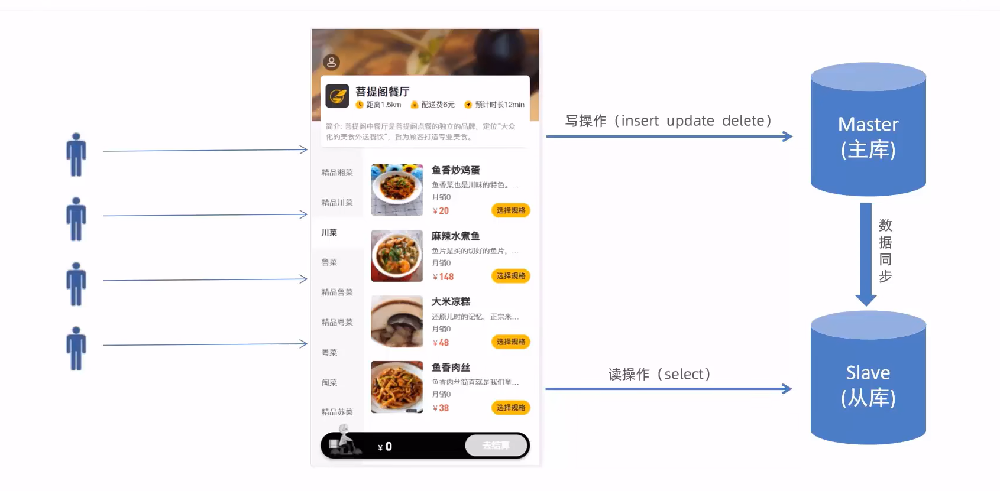
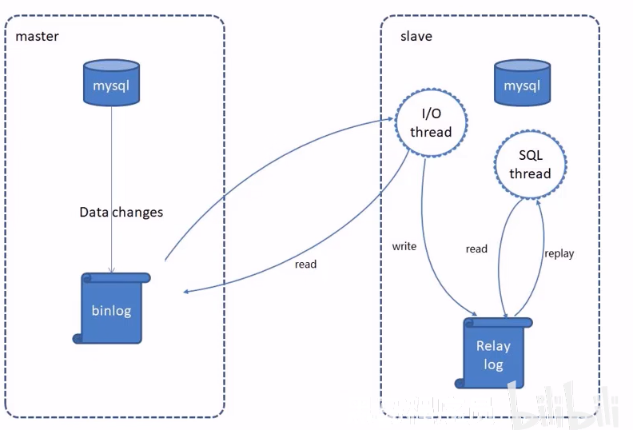

# MySql读写分离

## 使用Docker容器配置一台MySql服务器

- 拉取mysql镜像

  ```bash
  sudo docker pull mysql:8.0.28
  ```

- 运行容器

  ```bash
  docker run -d --name mysql -p 3307:3306 -e MYSQL_ROOT_PASSWORD=root mysql:8.0.28 --lower_case_table_names=1
  ```

  ```
  参数解释
  -v：挂载宿主机目录和 docker容器中的目录，前面是宿主机目录，后面是容器内部目录。
  -d：后台运行容器。
  -p：映射容器端口号和宿主机端口号。
  -e：环境参数，MYSQL_ROOT_PASSWORD设置root用户的密码。
  –lower_case_table_names： 表名在硬盘上以小写保存，名称比较对大小写不敏感。
  ```

二、修改密码并配置远程连接
1、进入容器

```
docker exec -it mysql bash
```

2、连接并切换数据库

```bash
mysql -uroot -proot
use mysql
```

3、修改密码，设置所有主机可以访问

```bash
ALTER USER 'root'@'%' IDENTIFIED WITH mysql_native_password BY '新密码'
```

4、刷新权限

```bash
flush privileges
```

## 问题说明


当访问人员过多时，读和写都是由同一个数据库进行的操作，那么数据库的压力就会过大，容易造成单点故障



所以使用两个数据库，主库进行写操作，从库进行读操作，然后两个数据库进行数据同步（主从复制）即可

## 介绍

MySQL主从复制是一个异步的复制过程，底层是基于ysqI数据库自带的二进制日志功能。就是一台或多台MySQL数据库（slave,即从库)从另一台MySQL数据库（master.,即主库)进行日志的复制然后再解析日志并应用到自身，最终实现从库的数据和主库的数据保持一致。MySQL主从复制是MySQL数据库自带功能，无需借助第三方工具。

MySql主从复制分为三步

- master将改变记录到二进制日志(binary log)
- slave将masterl的binary log拷贝到它的中继日志(relay log)
- s1ave重做中继日志中的事件，将改变应用到自己的数据库中



## 