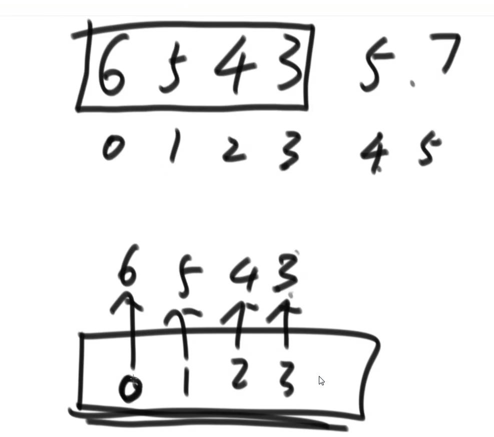
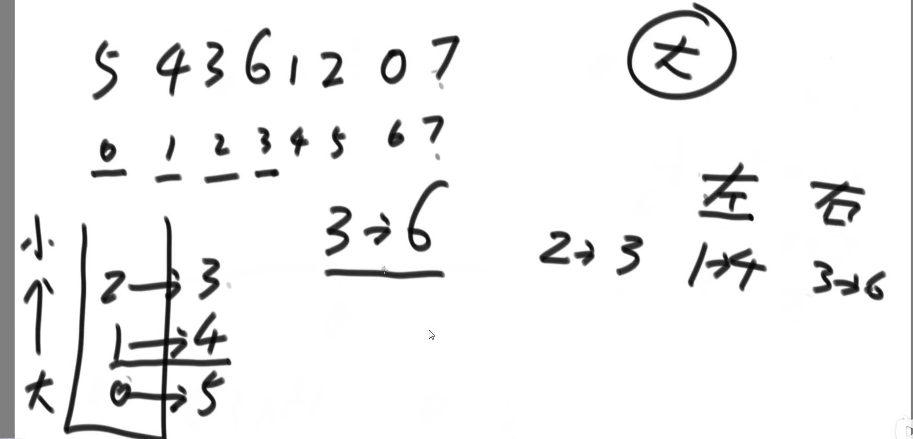
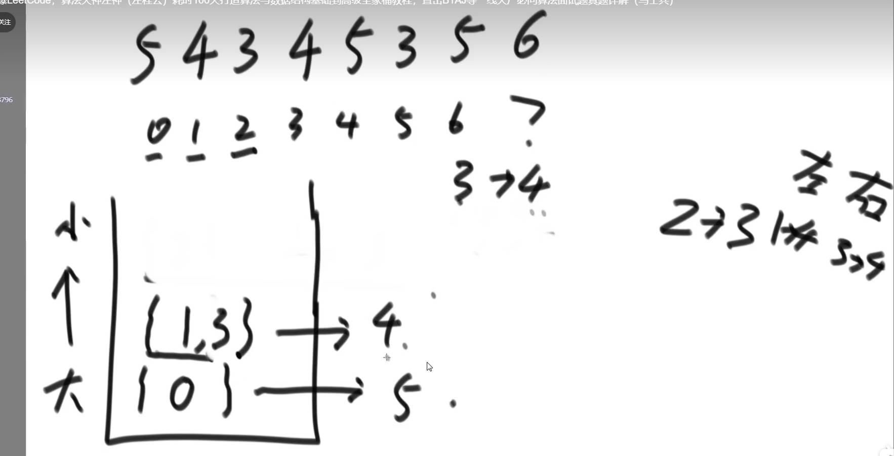

# 滑动窗口

> 一个窗口就是类似两个指针，一个指针L，一个指针R，满足以下要求就是窗口
>
> - R在右边，L在左边
> - L不超过R
> - L和R只能往右移动
>
> R往右移动，代表有一个数组移动到窗口里，L往右移动，代表有一个数字出去了

**R->右移**

确保窗口内的最大值可以选择使用双向队列，双向队列从左往右要严格保持单调性，当前元素如果如果比队尾元素大就把队尾元素弹出，知道没有数比他大，该数放到队尾。

**L->右移**

如果L往右移的话，要查看队列的头部位置是不是和L-1一样，如果一样就把队首弹出。

**双向队列中的信息**

> 如果R不动，L往右移动的话，双向队列的头部维持的信息是如果依次过期，头部就是依次成为最大值的顺序。



**滑动窗口最大值**

给你一个整数数组 `nums`，有一个大小为 `k` 的滑动窗口从数组的最左侧移动到数组的最右侧。你只可以看到在滑动窗口内的 `k` 个数字。滑动窗口每次只向右移动一位。

返回 *滑动窗口中的最大值* 。

**示例 1：**

```
输入：nums = [1,3,-1,-3,5,3,6,7], k = 3
输出：[3,3,5,5,6,7]
解释：
滑动窗口的位置                最大值
---------------               -----
[1  3  -1] -3  5  3  6  7       3
 1 [3  -1  -3] 5  3  6  7       3
 1  3 [-1  -3  5] 3  6  7       5
 1  3  -1 [-3  5  3] 6  7       5
 1  3  -1  -3 [5  3  6] 7       6
 1  3  -1  -3  5 [3  6  7]      7
```

**示例 2：**

```
输入：nums = [1], k = 1
输出：[1]
```

```java
public int[] maxSlidingWindow(int[] nums, int k) {
    if (nums.length <= k) {
        return new int[] { Arrays.stream(nums).max().getAsInt() };
    }
    Deque<Integer> deque = new LinkedList<>();
    List<Integer> list = new ArrayList<>();
    int R = 0;
    for (R = 0; R < k; R++) {
        while (!deque.isEmpty() && nums[deque.peekLast()] <= nums[R]) {
            deque.pollLast();
        }
        deque.addLast(R);
    }
    int L = 0;
    list.add(nums[deque.peekFirst()]);
    while (R < nums.length) {
        // 左移一位，删掉L位置的
        if (!deque.isEmpty() && deque.peekFirst() == L) {
            deque.pollFirst();
        }
        // 右移
        while (!deque.isEmpty() && nums[deque.peekLast()] <= nums[R]) {
            deque.pollLast();
        }
        deque.addLast(R++);
        L++;
        list.add(nums[deque.peekFirst()]);
    }

    int[] ans = new int[list.size()];
    for (int i = 0; i < list.size(); i++) {
        ans[i] = list.get(i);
    }
    return ans;
}
```

# 单调栈

> 实现一种结构，对于数组中的每一个元素，我都要知道，左边最近比他大的，右边最近比他大的。
>
> 如
>
> ```
> 5 4 6 7 2 1 3 0 1
> 0->5  左边 无，右边2->6
> 
> 1->4  左边 0->5 右边 2->6
> ```

**实现方法**

**无重复值**

准备一个栈，从栈底->栈顶，从大到小，然后从左往右依次遍历数组，如果满足从大到小，直接放数据即可，到$num$时不满足了，假设栈顶的元素时$s1$,下一个是$s2$，然后依次弹出，弹出的时候，信息开始生成，$s1$左边最近比它大的就是$s2$，右边最近比它大的就是$num$



最后遍历完之后，如果栈里面还有数据，则依次弹出栈，然后设置信息即可，此时右边最近比它大的无，左边最近比它大的是下一个元素。

**有重复值**

有重复值，使用链表，压入一个链表元素，元素里存着的是下标，然后同样从左到右遍历数组，在弹出的时候**(这里注意将该链表的所有元素的信息全部生成)**，**右边**离它最近比它大的就是**将要压入的元素**，而**左边**离它最近比它大的就是下面链表中的**最后一个元素**。然后压入的时候，如果相等，将下标压在一起即可。



```java
public Map<Integer, Node> trap(int[] height) {
    Map<Integer, Node> map = new HashMap<>();
    for (int i = 0; i < height.length; i++) {
        map.put(i, new Node(i));
    }
    Stack<LinkedList<Node>> stack = new Stack<>();
    for (int i = 0; i < height.length; i++) {
        Node cur = map.get(i);
        LinkedList<Node> stackUp = stack.isEmpty() ? null : stack.peek();
        // 栈不为空且当前值大于栈顶
        while (stackUp != null && height[stackUp.peek().val] < height[i]) {
            LinkedList<Node> pop = stack.pop();
            LinkedList<Node> peek = stack.isEmpty() ? null : stack.peek();
            // 更新栈顶元素
            stackUp = peek;

            // 针对当前链表的所有元素都要设置
            while (!pop.isEmpty()) {
                Node node = pop.pollFirst();
                node.right = cur;
                node.left = peek == null ? null : peek.peekLast();
            }
        }
        // 相等，放到一起
        if (stackUp != null && height[stackUp.peek().val] == height[i]) {
            stackUp.addLast(cur);
        } else {
            LinkedList<Node> list = new LinkedList<>();
            list.add(cur);
            stack.push(list);
        }
    }

    // 如果栈不为空
    while (!stack.isEmpty()) {
        LinkedList<Node> pop = stack.pop();
        LinkedList<Node> peek = stack.isEmpty() ? null : stack.peek();
        while (!pop.isEmpty()) {
            Node node = pop.pollFirst();
            node.right = null;
            node.left = peek == null ? null : peek.peekLast();
        }
    }

    return map;
}
```

## **接雨水**

给定 `n` 个非负整数表示每个宽度为 `1` 的柱子的高度图，计算按此排列的柱子，下雨之后能接多少雨水。

**示例 1：**


```
输入：height = [0,1,0,2,1,0,1,3,2,1,2,1]
输出：6
解释：上面是由数组 [0,1,0,2,1,0,1,3,2,1,2,1] 表示的高度图，在这种情况下，可以接 6 个单位的雨水（蓝色部分表示雨水）。 
```

**示例 2：**

```
输入：height = [4,2,0,3,2,5]
输出：9
```

**定制**

 ```java
 public int trap(int[] nums) {
     int ans = 0;
     Stack<Integer> stack = new Stack<>();
     for (int i = 0; i < nums.length; i++) {
         while (!stack.isEmpty() && nums[i] > nums[stack.peek()]) {
             Integer pop = stack.pop();
             if (stack.isEmpty()) {
                 break;
             }
             int left = stack.peek();
             int width = i - left - 1;
             int height = Math.min(nums[i], nums[left]) - nums[pop];
             ans += width * height;
         }
         stack.push(i);
     }
     return ans;
 }
 ```

**暴力**

```java
class Solution {
class Node {
    public int val;
    public Node left;
    public Node right;

    public Node(int val) {
        this.val = val;
    }
}

public int trap(int[] height) {
    Map<Integer, Node> map = new HashMap<>();
    for (int i = 0; i < height.length; i++) {
        map.put(i, new Node(i));
    }
    Stack<LinkedList<Node>> stack = new Stack<>();
    for (int i = 0; i < height.length; i++) {
        Node cur = map.get(i);
        LinkedList<Node> stackUp = stack.isEmpty() ? null : stack.peek();
        // 栈不为空且当前值大于栈顶
        while (stackUp != null && height[stackUp.peek().val] < height[i]) {
            LinkedList<Node> pop = stack.pop();
            LinkedList<Node> peek = stack.isEmpty() ? null : stack.peek();
            // 更新栈顶元素
            stackUp = peek;

            // 针对当前链表的所有元素都要设置
            while (!pop.isEmpty()) {
                Node node = pop.pollFirst();
                node.right = cur;
                node.left = peek == null ? null : peek.peekLast();
            }
        }
        // 相等，放到一起
        if (stackUp != null && height[stackUp.peek().val] == height[i]) {
            stackUp.addLast(cur);
        } else {
            LinkedList<Node> list = new LinkedList<>();
            list.add(cur);
            stack.push(list);
        }
    }

    // 如果栈不为空
    while (!stack.isEmpty()) {
        LinkedList<Node> pop = stack.pop();
        LinkedList<Node> peek = stack.isEmpty() ? null : stack.peek();
        while (!pop.isEmpty()) {
            Node node = pop.pollFirst();
            node.right = null;
            node.left = peek == null ? null : peek.peekLast();
        }
    }

    int res = 0;
    for (int i = 0; i < height.length; i++) {
        Node curNode = map.get(i);
        if (curNode.left == null || curNode.right == null) {
            continue;
        }

        Node right = curNode;
        Node left = curNode;
        while (right.right != null) {
            right = right.right;
        }
        while (left.left != null) {
            left = left.left;
        }
        res = res + Math.min(height[right.val], height[left.val]) - height[curNode.val];
    }
    return res;
}
}
```

